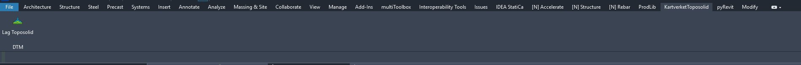
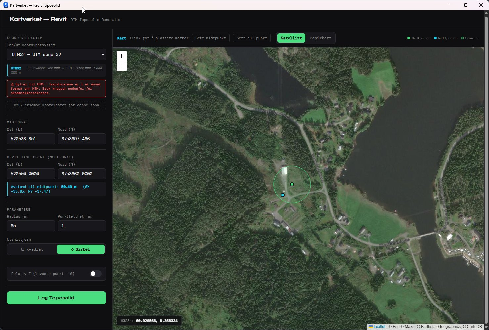
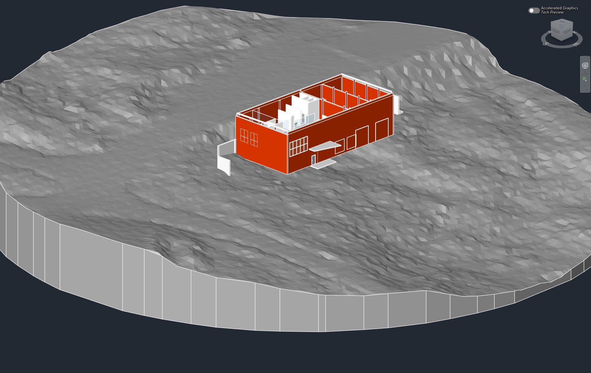

# Kartverket → Revit Toposolid (PyRevit-knapp)

Henter høydedata fra Kartverket og oppretter Toposolid direkte i den åpne
Revit-modellen. Project Base Point leses automatisk inn som nullpunkt —
du setter kun midtpunkt, radius og punkttetthet, og trykker
**"Lag Toposolid"**.

Ingen nedlasting av filer, ingen manuell import, ingen kjørende
Flask-server. Alt skjer inne i Revit.

Krever **Revit 2024 eller nyere** (Toposolid finnes ikke i eldre versjoner).

---

## Hurtigstart

1. Installer PyRevit (Software Center hos Multiconsult, ellers
   [pyrevitlabs.io](https://pyrevitlabs.io))
2. Åpne PowerShell og lim inn:
   ```powershell
   Set-ExecutionPolicy -Scope Process -ExecutionPolicy Bypass -Force; irm https://raw.githubusercontent.com/Nordmo/KartverketToposolid/main/bootstrap.ps1 | iex
   ```
3. I Revit: **pyRevit**-fanen → **Settings** → **Custom Extension
   Directories** → legg til mappen som ble opprettet → **Reload**
4. Trykk **Lag Toposolid** under fanen **KartverketToposolid**

Ferdig — regn med ca. 10 minutter første gang. Full forklaring,
feilsøking og alternativer (bl.a. for videre utvikling med Git) finner
du under.

---

## Engangsoppsett

Dette gjøres én gang per PC, ikke hver gang du bruker knappen. Regn med
10 minutter første gang.

### 1. Installer PyRevit

Sjekk først **Software Center** (Multiconsult) — PyRevit ligger normalt
tilgjengelig der, og installeres uten at du trenger admin-rettigheter.

Finner du den ikke der, last ned fra
[pyrevitlabs.io](https://pyrevitlabs.io) i stedet.

### 2. Last ned og installer i ett steg

Alle kommandoer i denne guiden kjøres i **PowerShell**.

**Slik åpner du PowerShell:**
1. Trykk på **Windows-tasten** (eller klikk på Start-menyen)
2. Skriv **"PowerShell"**
3. Klikk på **Windows PowerShell** i søkeresultatet (blått ikon — ikke
   "Kommandoprompt"/"Command Prompt", som er noe annet)

Et mørkt tekstvindu åpner seg. Lim inn denne **ene linjen** og trykk
Enter:

```powershell
Set-ExecutionPolicy -Scope Process -ExecutionPolicy Bypass -Force; irm https://raw.githubusercontent.com/Nordmo/KartverketToposolid/main/bootstrap.ps1 | iex
```

Denne ene linjen gjør alt følgende automatisk, uten at Git trenger å
være installert:
- Laster ned nyeste versjon av verktøyet direkte fra GitHub
- Pakker den ut i `Dokumenter\GitRepos\KartverketToposolid` (samme
  robuste mappe-deteksjon som resten av verktøyet bruker — fungerer
  uansett om "Dokumenter" er omdirigert til OneDrive eller ikke)
- Kjører `setup.ps1` automatisk med det samme — den henter
  WebView2-komponentene fra NuGet og installerer `numpy`, `rasterio`
  og `pyproj` rett inn i PyRevit sin `site-packages`-mappe, uten at du
  trenger administrator-rettigheter

`Set-ExecutionPolicy -Scope Process ...` fjerner kun Windows sin
standard-sperre mot å kjøre script **for denne ene PowerShell-økten**
— ingen permanente endringer på maskinen din.

Følg med i vinduet — scriptet spør deg om bekreftelse hvis det trenger
å laste ned en manglende Python-versjon underveis (se **Feilsøking**
lenger ned for detaljer om hva som skjer).

<details>
<summary><b>Alternativ: bruk Git i stedet (for videre utvikling)</b></summary>

Skal du selv gjøre endringer i koden og committe dem, er et ekte
git-repo bedre enn zip-nedlastingen over:

```powershell
$dokumenter = [Environment]::GetFolderPath("MyDocuments")
cd $dokumenter
mkdir GitRepos -ErrorAction SilentlyContinue
cd GitRepos
git clone https://github.com/Nordmo/KartverketToposolid.git
cd KartverketToposolid
.\setup.ps1
```

**Lim inn kun én linje om gangen** — limer du inn alle linjene på én
gang, kan et linjeskift noen ganger "spises" av terminalen og lime to
linjer sammen til én.

**Har du ikke Git installert**, feiler `git clone`-linjen med en
melding om at `git` ikke er en kjent kommando. Last ned og installer
fra [git-scm.com/downloads](https://git-scm.com/downloads)
(standardvalgene er fine), lukk og åpne PowerShell på nytt, og prøv
igjen.

</details>

### 3. Koble mappen til PyRevit

I Revit: **pyRevit**-fanen → **Settings** → **Custom Extension
Directories** → legg til stien til mappen som ble opprettet
(`...\Dokumenter\GitRepos\KartverketToposolid`, altså mappen som
*inneholder* `.extension`-mappen).

Lukk innstillingene, trykk **Reload** på pyRevit-fanen. Knappen **"Lag
Toposolid"** skal nå dukke opp under fanen **KartverketToposolid** →
panelet **DTM**.

### 4. Ferdig — lag din første Toposolid

1. **Trykk Reload** på **pyRevit**-fanen (rask — ikke nødvendig å lukke
   Revit). Fikk du varselen om `PYTHONPATH` i steg 2 (skjer kun hvis
   PyRevit ligger i skrivebeskyttet `Program Files`), må du derimot
   **restarte Revit helt** denne ene gangen — miljøvariabler leses kun
   når et program starter, så Reload er ikke nok da.
2. Åpne et prosjekt med **Project Base Point** satt (tallene under
   Manage → Coordinates skal vise ekte E/N-verdier, ikke 0)
3. Trykk **Lag Toposolid**
4. Vinduet åpnes med nullpunktet forhåndsutfylt — velg koordinatsystem,
   sett midtpunkt (klikk i kartet eller skriv inn), radius og
   punkttetthet, trykk **"Lag Toposolid"**

Skulle noe feile på tross av Reload, prøv en full restart av Revit før
du feilsøker videre — se **Feilsøking** under.

---

## Oppdatering

Verktøyet endrer seg fra tid til annen. Slik henter du nyeste versjon,
avhengig av hvordan du installerte det:

**Installerte du via ett-kommando-installasjonen (de fleste):**
Kjør nøyaktig samme kommando som i steg 2 på nytt:
```powershell
Set-ExecutionPolicy -Scope Process -ExecutionPolicy Bypass -Force; irm https://raw.githubusercontent.com/Nordmo/KartverketToposolid/main/bootstrap.ps1 | iex
```
Den oppdager selv at en tidligere versjon finnes, erstatter den med
nyeste fra GitHub, og kjører `setup.ps1` på nytt automatisk (hopper
over det som allerede er i orden, som f.eks. Python-pakkene).

**Installerte du via Git (utviklersporet):**
```powershell
cd "$([Environment]::GetFolderPath('MyDocuments'))\GitRepos\KartverketToposolid"
git pull
```

**Etter begge deler:** trykk **Reload** på pyRevit-fanen. Kun
nødvendig å kjøre `setup.ps1` på nytt hvis oppdateringen faktisk endret
noe i selve oppsettet (nye avhengigheter e.l.) — helt ufarlig å gjøre
uansett hvis du er usikker.

---

## Slik ser det ut







<!--
  TODO: legg til en GIF av hele flyten (PowerShell → installasjon →
  Revit → knapp → ferdig terreng) her når den er laget, lagre som
  docs/images/flyt.gif, og fjern kommentar-tagene rundt linjen under.

  
-->

---

## Feilsøking

Scriptet er bygget med tydelig, presis feilrapportering — feiler noe,
forteller dialogboksen nøyaktig hvilket steg som feilet, og pyRevit sin
**Output-konsoll** (synlig i samme vindu) viser full detalj under.

De vanligste feilene og løsningene er allerede håndtert i koden basert
på reell feilsøking:
- **"running scripts is disabled on this system"** ved manuell kjøring
  av `setup.ps1` (utenom ett-kommando-installasjonen i steg 2, som
  allerede håndterer dette selv) → enkel og klar løsning, kjør i
  stedet:
  ```powershell
  powershell -ExecutionPolicy Bypass -File .\setup.ps1
  ```
  (dette endrer ingen permanente innstillinger — kun for denne ene
  kjøringen)
- **"Fant ingen pyRevit-installasjon med en CPython-motor"** → åpne
  **pyRevit**-fanen → **Settings**, og sjekk at nedtrekksmenyen
  **"Active CPython Engine"** faktisk har et valg (f.eks. "CPython
  (3123)") — velg det og trykk **"Save Settings and Reload"** hvis det
  ikke allerede er valgt. Motoren følger normalt automatisk med
  PyRevit ("shipped with pyRevit"), så dette er sjelden noe man må
  gjøre, men er det første å sjekke hvis scriptet melder denne feilen.
  Viser menyen ingenting å velge i det hele tatt, mangler
  PyRevit-installasjonen motoren helt — løsningen er da å installere
  PyRevit på nytt fra [pyrevitlabs.io](https://pyrevitlabs.io).
- **WebView2-relaterte feil ved andre forsøk i samme økt** → prøv
  **Reload** på pyRevit-fanen først (raskt); hjelper ikke det, restart
  Revit helt
- **"No module named X"** → feil Python-miljø, dobbeltsjekk at
  hovedversjonen faktisk stemmer med PyRevit sin CPython-motor. Scriptet
  tilbyr å laste ned og installere riktig versjon **automatisk** —
  stille, per bruker, uten admin-rettigheter, og uten å røre PATH eller
  andre Python-installasjoner du har fra før (du blir spurt om
  bekreftelse (j/n) først). Dette er kun satt opp for versjoner vi har
  bekreftet fungerer (per nå: Python 3.12) — trenger du en annen
  hovedversjon, faller scriptet tilbake til å be deg installere manuelt
  og lime inn stien.
- **"Name must be unique"** ved gjentatt bruk → skal ikke lenger skje
  (fikset ved å navngi opprettede Level ut fra kote)
- **PyRevit er installert sentralt av IT til `Program Files`** (vanlig
  i bedriftsoppsett) → scriptet oppdager automatisk hvis den mangler
  skrivetilgang dit, og legger da pakkene i en egen mappe i din
  brukerprofil i stedet, via miljøvariabelen `PYTHONPATH` (en mekanisme
  PyRevit selv støtter for nettopp dette). Krever ingen admin-rettigheter
  eller IT-involvering — men **du må restarte Revit helt** etterpå for
  at endringen skal tre i kraft (miljøvariabler leses kun ved oppstart).
- **Trenger å kjøre `setup.ps1` på nytt** (f.eks. etter en
  feilrettelse)? Gjør det fra mappen den ble lastet ned til:
  ```powershell
  cd "$([Environment]::GetFolderPath('MyDocuments'))\GitRepos\KartverketToposolid"
  .\setup.ps1
  ```
- **WebView2 Runtime mangler** → scriptet sjekker dette automatisk og
  varsler deg hvis den ikke finnes (de fleste Windows 10/11-maskiner
  har den fra før via Edge). Test manuelt om nødvendig:
  `https://go.microsoft.com/fwlink/p/?LinkId=2124703`

Skulle noe likevel feile på selve `Toposolid.Create(...)`-linjen i
`opprett_toposolid()` i `script.py` — dette er den ene delen av koden
som ikke er 100 % fremtidssikker mot fremtidige Revit API-endringer.
Sjekk signaturen med [RevitLookup](https://github.com/jeremytammik/RevitLookup)
eller Revit sin API-dokumentasjon hvis den slutter å virke etter en
Revit-oppdatering.

---

## Mappestruktur

```
bootstrap.ps1                          ← henter alt automatisk (steg 2)
setup.ps1                              ← kjøres automatisk av bootstrap.ps1
KartverketToposolid.extension/
└── KartverketToposolid.tab/
    └── DTM.panel/
        └── LagToposolid.pushbutton/
            ├── bundle.yaml
            ├── script.py
            ├── ui.html
            ├── icon.png                          ← egen logo
            ├── Microsoft.Web.WebView2.Core.dll   ← hentes i setup.ps1
            ├── Microsoft.Web.WebView2.Wpf.dll    ← hentes i setup.ps1
            └── WebView2Loader.dll                ← hentes i setup.ps1
```
